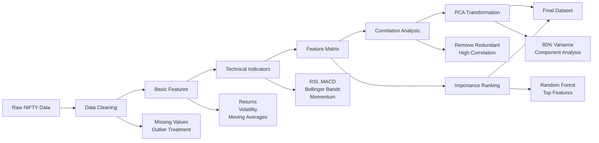

# Week 2 Assignment — Feature Engineering and Selection for NIFTY 50 Return Prediction

## Objective

This assignment challenges you to build a comprehensive feature engineering pipeline for predicting NIFTY 50 index returns. You'll apply data cleaning, feature creation, selection techniques, and deliver a production-ready dataset for machine learning models.

**Learning Goals:**
- Master financial data preprocessing and cleaning techniques
- Create meaningful features from raw OHLCV data using technical analysis
- Apply feature selection methods (correlation analysis, PCA, importance ranking)
- Build a reproducible feature engineering pipeline
- Analyze and interpret feature relationships in financial markets

## Dataset Instructions

### Primary Dataset: NIFTY 50 Index (^NSEI)
Use the yfinance library to download NIFTY 50 data:
```python
import yfinance as yf
nifty_data = yf.download('^NSEI', start='2019-01-01', end='2024-01-01')
```

### Backup Options:
1. If NIFTY 50 is unavailable, use S&P 500 (^GSPC)
2. If internet access is limited, use the provided synthetic dataset
3. For additional analysis, consider including USDINR (INR=X) currency data

**Data Period:** 2019-2024 (5 years of data for robust analysis)

## Required Skills

- **Python Libraries:** pandas, numpy, matplotlib, seaborn, sklearn
- **Statistical Methods:** Correlation analysis, PCA, variance inflation factor
- **Machine Learning:** Random Forest for feature importance
- **Financial Knowledge:** Technical indicators, market data interpretation
- **Data Visualization:** Heatmaps, scatter plots, time series charts

## Detailed Tasks

### Task 1: Data Loading and Quality Assessment (15 points)

#### 1.1 Data Acquisition
- Download NIFTY 50 daily data (2019-2024)
- Verify data completeness and date continuity
- Handle weekends and Indian market holidays appropriately

#### 1.2 Data Quality Check
- Identify missing values and their patterns
- Detect outliers using statistical methods (IQR, Z-score)
- Check for data inconsistencies (negative prices, volume anomalies)
- Document any data quality issues found

#### 1.3 Data Cleaning
- Implement appropriate missing value treatment (forward-fill for prices)
- Apply winsorization for extreme outliers (cap at 1st/99th percentiles)
- Ensure data integrity and logical consistency

**Deliverable:** Clean dataset with documented quality assessment report

---

### Task 2: Comprehensive Feature Engineering (30 points)

#### 2.1 Basic Price Features (8 points)
Create fundamental price-based features:
- Simple returns: `(Price_t - Price_{t-1}) / Price_{t-1}`
- Log returns: `ln(Price_t / Price_{t-1})`
- Multi-period returns (5, 10, 20 day)
- Overnight gaps and intraday ranges

#### 2.2 Moving Average Features (8 points)
- Simple Moving Averages (10, 20, 50 day)
- Exponential Moving Averages (10, 20 day)
- Price-to-MA ratios for trend identification
- Moving average crossover signals

#### 2.3 Volatility Features (7 points)
- Rolling volatility (5, 10, 20 day windows)
- Volatility normalization (current vs historical average)
- High-Low range as volatility proxy
- GARCH-based volatility (bonus)

#### 2.4 Technical Indicators (7 points)
Implement the following indicators manually (show calculations):
- **RSI (Relative Strength Index):** 14-day period
- **MACD:** 12/26/9 configuration with signal line
- **Bollinger Bands:** 20-day with ±2σ bands
- **Momentum indicators:** Rate of Change, Price Momentum

**Deliverable:** Feature matrix with 40+ engineered features

---

### Task 3: Feature Selection and Analysis (25 points)

#### 3.1 Correlation Analysis (8 points)
- Create comprehensive correlation heatmap
- Identify highly correlated pairs (|correlation| > 0.8)
- Calculate correlations with target variable (next-day returns)
- Remove redundant features based on correlation

#### 3.2 Principal Component Analysis (9 points)
- Standardize features before PCA application
- Determine optimal number of components (80-90% variance)
- Analyze component loadings and interpret economic meaning
- Create PCA-transformed dataset

#### 3.3 Feature Importance Ranking (8 points)
- Train Random Forest regressor on feature matrix
- Extract and rank feature importance scores
- Identify top features contributing 80% of importance
- Compare PCA components with importance rankings

**Deliverable:** Reduced feature set with selection justification

---

### Task 4: Visualization and Insights (20 points)

#### 4.1 Exploratory Visualizations (10 points)
Create professional visualizations:
- Time series plot of NIFTY 50 with major events marked
- Feature correlation heatmap (top 20 features)
- Distribution plots for key technical indicators
- Rolling volatility with regime identification

#### 4.2 Feature Analysis Charts (10 points)
- Feature importance bar chart with category grouping
- PCA explained variance and component analysis
- Scatter plots showing feature-target relationships
- Technical indicator signals vs price movements

**Deliverable:** Comprehensive visualization portfolio

---

### Task 5: Final Dataset and Documentation (10 points)

#### 5.1 Dataset Export
- Export full engineered dataset as `engineered_nifty.csv`
- Create reduced dataset with top features as `nifty_selected_features.csv`
- Include feature metadata and data dictionary

#### 5.2 Feature Importance Report
Create a structured analysis report covering:
- Top 10 most predictive features with economic interpretation
- PCA vs importance ranking comparison
- Feature categories and their relative importance
- Recommendations for model building

**Deliverable:** Production-ready datasets with documentation

---

## Feature Engineering Pipeline Diagram



## Deliverables

Submit all files in a ZIP archive named `week2_assignment_[LASTNAME].zip`:

### 1. Jupyter Notebook (`nifty_feature_engineering.ipynb`)
- Complete implementation of all tasks
- Clear markdown explanations for each section
- Well-commented code with docstrings
- All cells executed with visible outputs
- Runtime under 5 minutes for complete execution

### 2. Engineered Datasets
- `engineered_nifty.csv`: Full feature matrix
- `nifty_selected_features.csv`: Top features only
- `feature_metadata.json`: Data dictionary and statistics

### 3. Feature Analysis Report (`feature_analysis_report.pdf`)
- **Executive Summary:** Key findings and recommendations
- **Data Quality Assessment:** Issues identified and resolved
- **Feature Engineering Process:** Methodology and rationale
- **Selection Results:** Top features with business interpretation
- **Model Readiness:** Dataset suitability for ML applications
- **Appendix:** Additional technical details and charts

### 4. Visualization Portfolio (`visualizations/`)
- High-resolution PNG files for all major charts
- Include: correlation heatmap, feature importance, PCA analysis
- Professional formatting suitable for presentation

## Grading Rubric

| Component | Excellent (90-100%) | Good (80-89%) | Satisfactory (70-79%) | Needs Improvement (<70%) |
|-----------|---------------------|---------------|----------------------|-------------------------|
| **Data Cleaning & Preprocessing (15 pts)** | Comprehensive quality assessment, appropriate cleaning methods, well-documented process | Good data cleaning with minor gaps in assessment | Basic cleaning performed, some quality issues remain | Inadequate cleaning, significant data quality problems |
| **Feature Engineering (30 pts)** | All feature categories implemented correctly, creative additional features, sound methodology | Most features implemented well, good technical understanding | Basic features created, some implementation errors | Limited feature creation, poor understanding of concepts |
| **Feature Selection (25 pts)** | Sophisticated selection methods, clear interpretation of results, justified decisions | Good application of selection techniques, reasonable interpretations | Basic selection performed, limited analysis | Poor selection methodology, weak justification |
| **Visualization & Insights (20 pts)** | Professional, insightful visualizations with clear business interpretation | Good visualizations with adequate insights | Basic charts with limited interpretation | Poor visualizations, no meaningful insights |
| **Report Quality (10 pts)** | Clear, professional report with actionable insights | Well-structured report with good analysis | Adequate report meeting basic requirements | Poor report quality, unclear communication |

### Bonus Points (up to 10 additional points):
- **Advanced Features (+3 points):** Implementation of GARCH volatility or other sophisticated indicators
- **Cross-Market Analysis (+3 points):** Include USD/INR or other relevant economic indicators
- **Model Validation (+2 points):** Train simple models to validate feature effectiveness
- **Code Quality (+2 points):** Exceptional code organization, reusable functions, comprehensive testing

## Bonus Challenge 💡

### Challenge: Cross-Asset Feature Engineering
Extend your analysis by incorporating related financial instruments:
1. Add USD/INR exchange rate data as macro feature
2. Include crude oil prices (relevant for Indian economy)
3. Create cross-asset momentum and correlation features
4. Analyze how global factors affect NIFTY 50 predictability

### Expected Outcomes:
- Enhanced feature set with macro variables
- Analysis of domestic vs global factor importance
- Insights into Indian market's international dependencies

## Submission Guidelines

### Technical Requirements:
- **File Size:** Keep ZIP file under 50MB
- **Code Quality:** PEP 8 compliant Python code
- **Reproducibility:** Include seed settings for random operations
- **Dependencies:** List all required packages in requirements.txt

### Naming Convention:
- Main notebook: `nifty_feature_engineering_[LASTNAME].ipynb`
- Report: `feature_analysis_report_[LASTNAME].pdf`
- Data files: Include student name in metadata

### Deadline and Submission:
- **Due Date:** Two weeks from assignment date
- **Submission Portal:** Course management system
- **Late Policy:** 10% deduction per day, max 3 days late

## Common Pitfalls to Avoid

### Technical Pitfalls:
1. **Look-ahead Bias:** Using future information in feature creation
2. **Data Leakage:** Including target-dependent information in features
3. **Overfitting:** Creating too many features relative to sample size
4. **Scale Issues:** Forgetting to standardize features for PCA

### Analytical Pitfalls:
1. **Correlation vs Causation:** Misinterpreting statistical relationships
2. **Feature Interpretation:** Not providing economic rationale for selections
3. **Sample Size:** Not considering statistical significance of relationships
4. **Market Regime:** Ignoring potential structural breaks in relationships

## Learning Resources

### Essential Reading:
1. **"Python for Finance" by Yves Hilpisch** - Chapters on technical analysis and feature engineering
2. **"Quantitative Trading" by Ernest Chan** - Feature selection and model validation techniques

### Technical Documentation:
1. **scikit-learn Feature Selection** - Official guide to feature selection methods
2. **pandas Technical Analysis** - Time series manipulation and rolling calculations
3. **yfinance Documentation** - Data download and adjustment procedures

### Market Context:
1. **NSE Technical Analysis** - Understanding NIFTY 50 composition and behavior
2. **Indian Market Structure** - Trading hours, holidays, and market microstructure

## Getting Help

### Office Hours:
- **Time:** [Insert schedule]
- **Location:** [Insert details]
- **Focus:** Technical implementation and concept clarification

### Discussion Forum:
- Post questions about data issues or technical challenges
- Share interesting findings (without complete solutions)
- Collaborate on interpretation of results

### Email Support:
- **Technical Issues:** [Insert email]
- **Conceptual Questions:** Use office hours or forum
- **Extension Requests:** Minimum 48 hours notice required

---

**Academic Integrity Note:** This is an individual assignment. While you may discuss concepts and approaches with classmates, all code, analysis, and report content must be your original work. Cite any external resources or code snippets used.

**Good luck building your feature engineering expertise! Remember: Great features make great models.** 📈