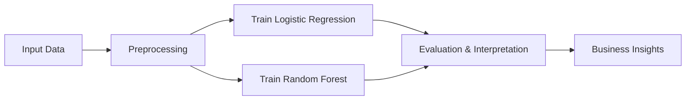

# Week 3 Assignment — Credit Scoring Model using Supervised ML Algorithms

## Objective
Build a credit scoring model to predict default risk using three supervised ML algorithms: Logistic Regression, Random Forest, and XGBoost.

## Dataset
- Use `data/synthetic/credit_scoring.csv` (provided)
- Or download a public dataset (Home Credit Default Risk, German Credit)

## Tasks

### 1. Data Preprocessing & EDA (15 marks)
- Load and explore the dataset
- Check class balance, missing values, summary statistics
- Encode categorical features (LabelEncoder/OneHotEncoder)
- Standardize numerical features

### 2. Model Implementation (25 marks)
- Train Logistic Regression, Random Forest, and XGBoost
- Use SEED=42 for reproducibility
- Handle class imbalance (class_weight or SMOTE)

### 3. Evaluation Metrics & Visuals (25 marks)
- Compute Accuracy, Precision, Recall, F1, ROC-AUC
- Plot ROC curves and Confusion Matrices for all models

### 4. Interpretation & Insights (20 marks)
- Identify top 5 most important features (coefficients or feature importance)
- Discuss model strengths/weaknesses
- Write a one-page summary comparing models and recommending the best approach

### 5. Report Quality (15 marks)
- Clear notebook structure, markdown explanations, and professional plots
- Submit a PDF/Markdown report summarizing findings

## Deliverables
- Notebook: `Week3_Assignment_CreditScoring.ipynb`
- Plots: ROC curves, Confusion Matrices
- Report: PDF or Markdown summary

## Grading Rubric
| Criteria                   | Marks |
|----------------------------|-------|
| Data Preprocessing & EDA   | 15    |
| Model Implementation       | 25    |
| Evaluation Metrics & Visuals| 25   |
| Interpretation & Insights  | 20    |
| Report Quality             | 15    |
| **Total**                  | 100   |

## Bonus Challenge 💡
Train a Gradient Boosting or LightGBM model and compare SHAP values for feature importance.

---

## Workflow Diagram

