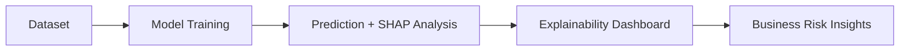

# Week 3 Challenge — Credit Default Prediction with Explainable AI (XAI)

## Prompt
Build a credit scoring model using RandomForest or XGBoost. Use SHAP to interpret feature impacts. Generate a dashboard-style visualization of SHAP values for the top 10 features. Discuss model fairness and interpretability for financial decisions.

## Deliverables
- Notebook: `Week3_Challenge_XAI_CreditScoring.ipynb`
- Visualization plots (SHAP summary, dependence plots)
- Short summary (insights on interpretability and risk bias)

## Diagram

## Requirements
- Use provided synthetic or Kaggle credit scoring dataset
- Train RandomForest or XGBoost model
- Compute SHAP values for all features
- Visualize top 10 features (summary, dependence plots)
- Discuss fairness (e.g., bias in predictions, impact on protected groups)
- Summarize interpretability findings for business/risk teams

## Success Tips
- Use SEED=42 for reproducibility
- Document all steps and findings
- Use clear, professional visualizations
- Address fairness and regulatory concerns

---
*Challenge designed by Praveen Kumar | Financial ML Bootcamp | Week 3*