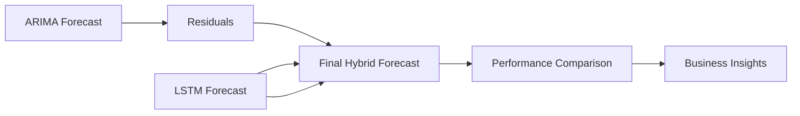

# Week 4 Challenge: Hybrid Financial Forecasting using ARIMA + LSTM Ensemble

## Overview

This advanced challenge explores **hybrid forecasting models** that combine the strengths of statistical and machine learning approaches. You'll build an ensemble that leverages ARIMA's linear pattern recognition with LSTM's non-linear modeling capabilities.

**Why Hybrid Models Matter:**
- ARIMA captures linear trends and autocorrelations
- LSTM handles complex non-linear patterns
- Ensemble methods often outperform individual models
- Real-world financial data contains both linear and non-linear components

---

## Challenge Objectives

By completing this challenge, you will:
1. **Build Individual Models**: Implement both ARIMA and LSTM forecasters
2. **Create Hybrid Architecture**: Combine models using residual analysis
3. **Perform Rolling Validation**: Test models using walk-forward methodology
4. **Analyze Performance**: Compare standalone vs ensemble approaches
5. **Visualize Results**: Create comprehensive comparison dashboards

---

## Dataset Requirements

**Primary Data**: Use **S&P 500 (^GSPC)** or **NIFTY 50 (^NSEI)** index
- **Period**: 2019-01-01 to 2025-01-01 (6 years)
- **Frequency**: Daily closing prices
- **Target**: Daily returns or log returns

**Backup**: If market data unavailable, use provided synthetic time series

---

## Challenge Tasks

### Task 1: Individual Model Development (40 points)

#### A. ARIMA Implementation (20 points)
```python
def build_arima_model(train_data, test_periods=30):
    """
    Build optimized ARIMA model with automatic parameter selection
    
    Requirements:
    1. Auto-determine (p,d,q) using AIC/BIC grid search
    2. Validate stationarity with ADF test
    3. Generate forecasts with confidence intervals
    4. Calculate residuals for hybrid modeling
    
    Returns:
    - fitted_model: Trained ARIMA model
    - forecasts: Point forecasts
    - residuals: Model residuals
    - conf_intervals: Forecast confidence intervals
    """
    # Your implementation here
    pass
```

#### B. LSTM Implementation (20 points)
```python
def build_lstm_model(train_data, lookback=30, test_periods=30):
    """
    Build LSTM neural network for time series forecasting
    
    Requirements:
    1. Create supervised learning dataset with sliding windows
    2. Design architecture: LSTM + Dropout + Dense layers
    3. Use appropriate scaling (MinMaxScaler)
    4. Implement early stopping and validation split
    
    Returns:
    - model: Trained LSTM model
    - forecasts: Scaled predictions
    - history: Training history
    """
    # Your implementation here
    pass
```

**Deliverables:**
- [ ] ARIMA model with optimal (p,d,q) parameters
- [ ] LSTM model with justified architecture choices
- [ ] Individual model evaluation metrics
- [ ] Residual analysis for ARIMA model

---

### Task 2: Hybrid Ensemble Architecture (50 points)

Create a sophisticated hybrid model using **residual-based combination**:

```python
def create_hybrid_ensemble(arima_model, lstm_model, train_data):
    """
    Combine ARIMA and LSTM using residual-based approach
    
    Methodology:
    1. Generate ARIMA forecasts
    2. Train LSTM on ARIMA residuals
    3. Combine: Final = ARIMA_forecast + LSTM_residual_forecast
    4. Add confidence intervals and uncertainty quantification
    
    Advanced Features:
    - Dynamic weighting based on recent performance
    - Residual pattern analysis
    - Ensemble confidence intervals
    """
    # Your implementation here
    pass
```

**Hybrid Architectures to Implement:**

**A. Simple Averaging:**
- `Hybrid_1 = 0.5 * ARIMA + 0.5 * LSTM`

**B. Residual-Based:**
- `Hybrid_2 = ARIMA + LSTM(ARIMA_residuals)`

**C. Performance-Weighted:**
- `Hybrid_3 = w1 * ARIMA + w2 * LSTM` (weights based on rolling RMSE)

**Deliverables:**
- [ ] Three hybrid ensemble variants
- [ ] Dynamic weighting mechanism
- [ ] Ensemble uncertainty quantification
- [ ] Performance-based weight updating

---

### Task 3: Rolling Forecast Validation (35 points)

Implement **walk-forward validation** to simulate real trading conditions:

```python
def rolling_forecast_validation(data, models, window_size=252, step_size=30):
    """
    Perform rolling forecasts with expanding/sliding windows
    
    Process:
    1. Start with initial training window
    2. Generate multi-step forecasts
    3. Move forward by step_size days
    4. Retrain models and repeat
    5. Collect all forecasts and actuals
    
    Metrics to Track:
    - RMSE, MAE, MAPE over time
    - Directional accuracy
    - Forecast bias analysis
    """
    # Your implementation here
    pass
```

**Validation Requirements:**
- Minimum 12 rolling windows
- 30-day forecast horizon per window
- Track performance degradation over time
- Compare expanding vs sliding window approaches

**Deliverables:**
- [ ] Rolling validation framework
- [ ] Performance metrics over time
- [ ] Model stability analysis
- [ ] Forecast accuracy by market regime

---

### Task 4: Comprehensive Performance Analysis (25 points)

Create detailed performance comparison and analysis:

**A. Quantitative Metrics:**
```python
def calculate_comprehensive_metrics(actuals, predictions):
    """
    Calculate extensive forecast evaluation metrics
    
    Metrics:
    - Standard: RMSE, MAE, MAPE
    - Financial: Directional accuracy, Hit rate
    - Statistical: Theil's U, SMAPE
    - Risk-adjusted: Information ratio, Maximum drawdown
    """
    # Your implementation here
    pass
```

**B. Qualitative Analysis:**
- Model interpretation and explainability
- Failure case analysis
- Market regime performance
- Computational efficiency comparison

**Deliverables:**
- [ ] Comprehensive metrics dashboard
- [ ] Statistical significance tests
- [ ] Model interpretation analysis
- [ ] Practical implementation recommendations

---

## Visualization Requirements

Create a **professional dashboard** with the following components:

### 1. Forecast Comparison Panel
```python
def create_forecast_dashboard(results):
    """
    Multi-panel visualization showing:
    - Actual vs predicted time series
    - Error distributions
    - Rolling performance metrics
    - Residual analysis plots
    """
    # Your implementation here
    pass
```

### 2. Performance Analytics
- Model accuracy over time
- Error decomposition analysis  
- Ensemble weight evolution
- Confidence interval coverage

### 3. Business Impact Visualization
- Trading signal accuracy
- Risk-adjusted returns
- Drawdown analysis
- Portfolio performance simulation

---

## Technical Requirements

### Code Quality Standards
- **Modular Design**: Separate functions for each model component
- **Error Handling**: Robust handling of edge cases and data issues
- **Documentation**: Clear docstrings and inline comments
- **Reproducibility**: Fixed random seeds and versioned dependencies

### Performance Optimization
- Efficient data structures (pandas/numpy)
- Vectorized operations where possible
- Memory management for large datasets
- GPU utilization for LSTM training (optional)

---

## Submission Requirements

### 1. Jupyter Notebook (`Week4_Challenge_ARIMA_LSTM_Ensemble.ipynb`)
- Complete implementation with clear sections
- Professional visualizations and analysis
- Executive summary with key findings

### 2. Python Module (`hybrid_forecasting.py`)
- Reusable functions for model building
- Clean, production-ready code
- Unit tests for key functions

### 3. Analysis Report (`Hybrid_Forecasting_Analysis.md`)
- **Executive Summary**: Key findings and recommendations
- **Methodology**: Detailed approach explanation
- **Results**: Performance comparison and insights
- **Conclusions**: Practical implications and next steps

### 4. Presentation (`Hybrid_Forecasting_Results.pdf`)
- 10-slide maximum presentation
- Key visualizations and insights
- Business implications and recommendations

---

## Evaluation Rubric

| Component | Excellent (A) | Good (B) | Satisfactory (C) | Needs Improvement (D) |
|-----------|---------------|----------|------------------|----------------------|
| **Technical Implementation** | All models correctly implemented, optimized | Minor issues, mostly correct | Basic functionality works | Significant technical problems |
| **Hybrid Architecture** | Sophisticated ensemble with multiple variants | Good hybrid approach | Basic combination method | Poor or missing ensemble |
| **Validation Methodology** | Comprehensive rolling validation | Good validation approach | Basic validation | Inadequate validation |
| **Analysis Depth** | Deep insights, statistical rigor | Good analysis with minor gaps | Basic analysis completed | Shallow or incomplete analysis |
| **Visualization Quality** | Professional, insightful dashboards | Good visualizations | Basic but functional plots | Poor or missing visualizations |

---

## Workflow Diagram



## Advanced Extensions (Bonus Points)

### 1. Multi-Asset Ensemble (+20 points)
- Apply hybrid model to portfolio of assets
- Cross-asset correlation analysis
- Portfolio-level forecast evaluation

### 2. Real-time Implementation (+15 points)
- Stream processing architecture
- Online model updating
- Latency optimization

### 3. Alternative Architectures (+25 points)
- Transformer-based forecasting
- Gaussian Process ensembles
- Bayesian model averaging

---

## Success Tips

1. **Start Simple**: Build individual models first, then combine
2. **Validate Thoroughly**: Use proper time series validation techniques  
3. **Focus on Interpretability**: Understand why the ensemble works
4. **Consider Practical Constraints**: Computational cost, data availability
5. **Document Everything**: Clear explanations enhance evaluation

---

**This challenge will significantly advance your understanding of ensemble forecasting methods and their practical application in financial markets. The hybrid approach you develop could serve as a foundation for professional trading algorithms.**

---

*Challenge designed by Praveen Kumar | Financial ML Bootcamp | Week 4*