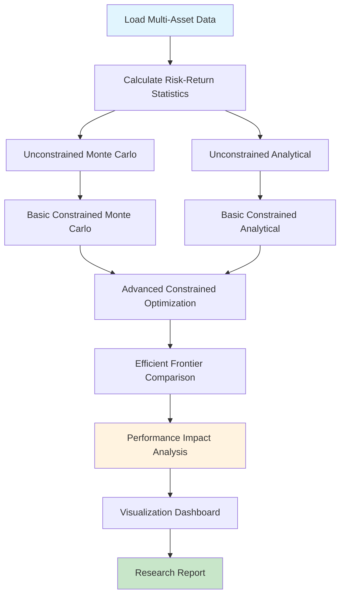

# Week 5 Challenge: Monte Carlo-Based Efficient Frontier Simulation

## Challenge Overview

Extend your portfolio optimization knowledge by implementing **constrained portfolio optimization** and comparing different approaches to efficient frontier construction. This challenge focuses on the practical constraints that real-world portfolio managers face and their impact on achievable performance.

**Key Learning Goals:**
- Implement realistic portfolio constraints
- Compare Monte Carlo vs analytical optimization approaches
- Understand the performance cost of practical constraints
- Create publication-quality comparative visualizations

---

## Challenge Prompt

Real-world portfolio management involves numerous constraints that theoretical models often ignore. In this advanced challenge, you'll implement and analyze the impact of realistic portfolio constraints on the efficient frontier.

**Core Challenge:**
1. Implement **unconstrained optimization** (baseline Modern Portfolio Theory)
2. Add **realistic constraints**: no short selling, position limits, minimum allocations  
3. Compare **Monte Carlo simulation** vs **analytical optimization** for both scenarios
4. Quantify the **performance cost** of realistic constraints
5. Create comprehensive **visualizations** showing the differences

---

## Technical Requirements

### Dataset Specifications
- **Assets**: 7-10 stocks from different sectors/asset classes
- **Suggested Mix**: 
  - US Large Cap: AAPL, MSFT, GOOGL
  - International: EFA (EAFE ETF), EEM (Emerging Markets)
  - Bonds: AGG (Aggregate Bond ETF), TLT (Long Treasury)
  - Commodities: GLD (Gold), USO (Oil)
  - Real Estate: VNQ (REIT ETF)
- **Time Period**: 2018-2024 (6+ years)
- **Frequency**: Daily data, minimum 1500 observations

### Constraint Specifications

#### Constraint Set A: Basic Constraints
- **No Short Selling**: All weights ≥ 0
- **Full Investment**: Weights sum to 1
- **Maximum Position**: No single asset > 40%

#### Constraint Set B: Advanced Constraints  
- **No Short Selling**: All weights ≥ 0
- **Full Investment**: Weights sum to 1
- **Maximum Position**: No single asset > 30%
- **Minimum Position**: Each asset ≥ 2% (if included)
- **Sector Limits**: No more than 50% in any single sector

---

## Implementation Tasks

### Task 1: Baseline Implementation (10 points)

**Implement unconstrained portfolio optimization:**

1. **Data Pipeline**:
   ```python
   def load_extended_universe(assets, start_date, end_date):
       # Load multi-asset class data
       # Handle missing data and alignment
       # Return prices and returns DataFrames
   ```

2. **Monte Carlo Baseline**:
   ```python
   def unconstrained_monte_carlo(returns, num_portfolios=50000):
       # Generate random weights (can be negative)
       # Calculate portfolio metrics
       # Return results dictionary
   ```

3. **Analytical Baseline**:
   ```python
   def unconstrained_optimization(expected_returns, cov_matrix, risk_free_rate):
       # Use scipy.optimize for exact solution
       # Allow negative weights (short selling)
       # Return optimal portfolio
   ```

**Deliverables:**
- Unconstrained efficient frontier (Monte Carlo)
- Analytical solution comparison
- Performance metrics comparison

---

### Task 2: Basic Constraints Implementation (15 points)

**Add no short selling and position limits:**

1. **Constrained Monte Carlo**:
   ```python
   def constrained_monte_carlo(returns, constraints, num_portfolios=50000):
       # Generate weights respecting constraints
       # Implement rejection sampling or direct generation
       # Compare efficiency vs unconstrained
   ```

2. **Constrained Analytical**:
   ```python
   def constrained_optimization(expected_returns, cov_matrix, constraints):
       # Use scipy.optimize with bounds and constraints
       # Implement multiple objective functions:
       #   - Maximum Sharpe ratio
       #   - Minimum variance  
       #   - Target return optimization
   ```

3. **Efficient Frontier Construction**:
   ```python
   def build_efficient_frontier(expected_returns, cov_matrix, constraints, n_points=100):
       # Generate points along efficient frontier
       # Handle constrained vs unconstrained cases
       # Return risk-return coordinates
   ```

**Deliverables:**
- Constrained efficient frontier
- Comparison with unconstrained frontier
- Optimal portfolio under constraints

---

### Task 3: Advanced Constraints and Analysis (15 points)

**Implement sector limits and minimum allocations:**

1. **Sector Classification**:
   ```python
   def classify_assets_by_sector(assets):
       # Define sector mappings
       # Create constraint matrices
       # Return sector groupings
   ```

2. **Advanced Constraint Optimization**:
   ```python
   def advanced_constrained_optimization(expected_returns, cov_matrix, 
                                       sector_constraints, position_constraints):
       # Implement complex constraint handling
       # Use SLSQP or interior-point methods
       # Handle infeasible constraint combinations
   ```

3. **Performance Attribution**:
   ```python
   def analyze_constraint_impact(unconstrained_results, constrained_results):
       # Calculate performance degradation
       # Identify binding constraints
       # Compute opportunity cost metrics
   ```

**Deliverables:**
- Advanced constrained optimization results
- Constraint impact analysis
- Binding constraint identification

---

### Task 4: Comparative Visualization Dashboard (10 points)

**Create comprehensive comparison visualizations:**

1. **Multi-Panel Efficient Frontier Comparison**:
   - Unconstrained vs Constrained frontiers
   - Monte Carlo vs Analytical results
   - Optimal portfolio locations
   - Constraint impact visualization

2. **Portfolio Composition Analysis**:
   - Weight distribution comparisons
   - Sector allocation analysis
   - Constraint utilization metrics

3. **Performance Impact Quantification**:
   - Sharpe ratio degradation
   - Return-risk trade-off changes
   - Opportunity cost visualization

**Required Visualizations:**
```python
def create_comparison_dashboard(results_dict):
    # 4-panel comparison plot
    # Interactive elements (optional)
    # Professional styling
    # Clear annotations and legends
```

---

## Advanced Analysis Framework

### Constraint Impact Metrics

1. **Performance Degradation**:
   ```
   Sharpe_Loss = (Sharpe_Unconstrained - Sharpe_Constrained) / Sharpe_Unconstrained
   Return_Cost = Return_Unconstrained - Return_Constrained  
   Risk_Penalty = Risk_Constrained - Risk_Unconstrained
   ```

2. **Efficiency Metrics**:
   ```
   Constraint_Efficiency = Sharpe_Constrained / Sharpe_Unconstrained
   Diversification_Ratio = Portfolio_Vol / Weighted_Average_Vol
   Active_Share = 0.5 * Σ|w_constrained - w_unconstrained|
   ```

3. **Binding Constraint Analysis**:
   ```python
   def identify_binding_constraints(optimization_result, constraints):
       # Check which constraints are active at optimum
       # Calculate shadow prices (Lagrange multipliers)
       # Rank constraints by impact
   ```

---

## Deliverables

### Primary Deliverables

1. **Jupyter Notebook**: `Week5_Challenge_PortfolioConstraints.ipynb`
   - Complete implementation of all tasks
   - Professional code documentation
   - Comprehensive analysis and interpretation

2. **Visualization Portfolio**: 
   - `Efficient_Frontier_Comparison.png`: Multi-scenario comparison
   - `Portfolio_Weights_Analysis.png`: Weight distribution analysis  
   - `Constraint_Impact_Dashboard.png`: Performance impact visualization

3. **Research Report**: `Portfolio_Optimization_Insights.pdf` (4-6 pages)
   - Executive summary of findings
   - Methodology explanation
   - Results analysis and interpretation
   - Practical implications for portfolio management

### Bonus Deliverables (Extra Credit)

4. **Interactive Dashboard** (Optional):
   - Plotly/Bokeh interactive visualizations
   - Parameter sensitivity analysis
   - Real-time constraint adjustment

5. **Backtesting Analysis** (Optional):
   - Out-of-sample performance comparison
   - Rolling optimization windows
   - Transaction cost analysis

---

## Workflow Diagram



---

## Evaluation Criteria

### Technical Implementation (60%)
- **Code Quality**: Clean, documented, modular code
- **Algorithmic Correctness**: Proper constraint handling
- **Computational Efficiency**: Reasonable execution times
- **Error Handling**: Robust error management

### Analysis Depth (25%)
- **Insight Generation**: Meaningful findings and interpretations
- **Quantitative Rigor**: Proper statistical analysis
- **Practical Relevance**: Real-world applicability
- **Critical Thinking**: Limitations and assumptions discussion

### Presentation Quality (15%)
- **Visualization Excellence**: Clear, publication-quality plots
- **Report Writing**: Professional documentation
- **Reproducibility**: Clear instructions and setup
- **Communication**: Effective results presentation

---

## Grading Rubric

| Component | Excellent (90-100%) | Good (80-89%) | Satisfactory (70-79%) | Needs Improvement (<70%) | Points |
|-----------|---------------------|---------------|----------------------|--------------------------|--------|
| **Baseline Implementation** | Perfect unconstrained implementation with analytical comparison | Good implementation with minor issues | Basic implementation working | Incomplete or buggy implementation | 10 |
| **Basic Constraints** | Elegant constraint handling with multiple methods | Good constraint implementation | Basic constraints working | Poor constraint handling | 15 |
| **Advanced Constraints** | Sophisticated constraint analysis with sector limits | Good advanced constraints | Basic advanced implementation | Incomplete advanced features | 15 |
| **Comparative Analysis** | Deep insights with quantitative impact analysis | Good comparison and analysis | Basic comparison provided | Shallow or missing analysis | 10 |
| **Total** | | | | | **50** |

---

## Resources and Support

### Technical References:
- **SciPy Optimization Guide**: [scipy.optimize documentation](https://docs.scipy.org/doc/scipy/reference/optimize.html)
- **Modern Portfolio Theory**: Markowitz (1952), Bodie-Kane-Marcus Ch. 6-7
- **Constraint Programming**: Boyd & Vandenberghe "Convex Optimization"

### Implementation Examples:
```python
# Constraint matrix example for sector limits
def create_sector_constraints(assets, sector_map, sector_limits):
    n_assets = len(assets)
    n_sectors = len(sector_limits)
    
    # Create constraint matrix A such that A @ weights <= b
    A = np.zeros((n_sectors, n_assets))
    b = np.zeros(n_sectors)
    
    for i, (sector, limit) in enumerate(sector_limits.items()):
        sector_assets = [j for j, asset in enumerate(assets) 
                        if sector_map[asset] == sector]
        A[i, sector_assets] = 1
        b[i] = limit
    
    return A, b
```

### Performance Optimization Tips:
- Use vectorized operations for Monte Carlo simulation
- Pre-compute matrix decompositions for repeated optimizations
- Implement parallel processing for parameter sweeps
- Cache expensive calculations

---

## Submission Guidelines

### File Structure:
```
Week5_Challenge_[YourName]/
├── Week5_Challenge_PortfolioConstraints.ipynb
├── Portfolio_Optimization_Insights.pdf
├── visualizations/
│   ├── Efficient_Frontier_Comparison.png
│   ├── Portfolio_Weights_Analysis.png
│   └── Constraint_Impact_Dashboard.png
├── data/
│   └── portfolio_data.csv
└── requirements.txt
```

### Code Standards:
- **Docstrings**: All functions must have docstrings
- **Type Hints**: Use type hints for function parameters
- **Testing**: Include basic unit tests for key functions
- **Reproducibility**: Set random seeds and version requirements

### Report Structure:
1. **Executive Summary** (0.5 pages)
2. **Methodology** (1-1.5 pages)  
3. **Results** (2-2.5 pages)
4. **Discussion and Implications** (1-1.5 pages)
5. **Conclusions** (0.5 pages)

---

**Due Date**: [Insert specific date - typically 3 weeks from assignment]  
**Late Penalty**: -15% per day late  
**Collaboration**: Individual work required, but discussion of concepts encouraged

---

*Week 5 Challenge | Financial ML Bootcamp | Praveen Kumar*