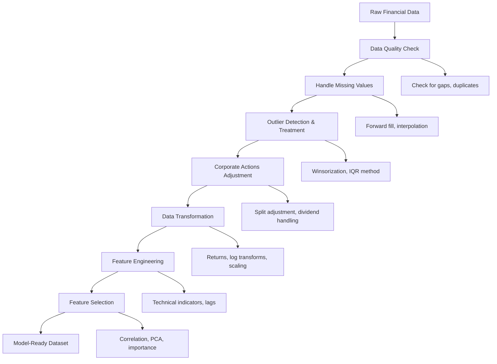
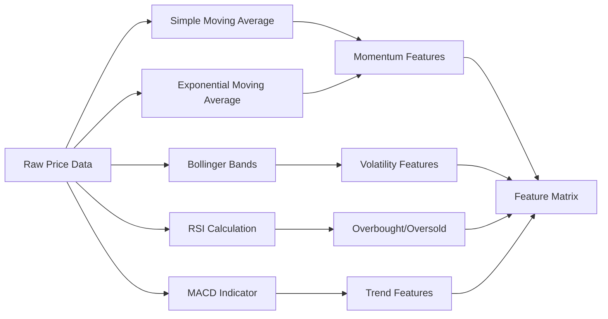
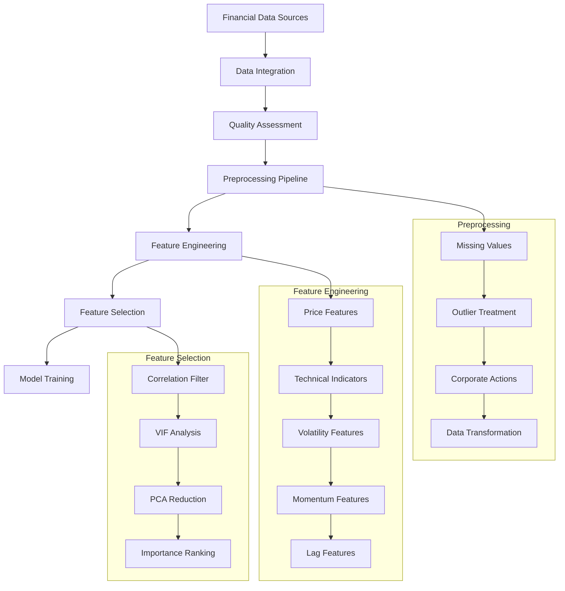

# Week 02 — Data Wrangling & Feature Engineering for Finance

## Learning Objectives

By the end of this week, you will be able to:
- Clean and preprocess financial time series data effectively
- Handle missing values, outliers, and corporate actions in financial datasets
- Engineer meaningful features from raw price and volume data
- Create technical indicators (RSI, MACD, Bollinger Bands) for predictive modeling
- Apply feature selection techniques including correlation analysis, VIF, and PCA
- Build a complete feature engineering pipeline for financial ML applications
- Evaluate feature importance using tree-based methods
- Export clean, model-ready datasets for downstream analysis

## Why Data Wrangling is Critical in Finance

Financial data presents unique challenges that make data wrangling particularly crucial:

**1. Data Quality Issues:**
- Missing values due to market holidays, trading halts, or data provider issues
- Outliers from flash crashes, earning announcements, or market manipulation
- Inconsistent data formats across different sources and time periods

**2. Financial-Specific Complications:**
- Stock splits and dividend adjustments affecting historical prices
- Currency fluctuations for international assets
- Different trading schedules across global markets
- Survivorship bias in historical datasets

**3. Time Series Characteristics:**
- Non-stationarity requiring transformations (returns vs prices)
- Volatility clustering and regime changes
- Look-ahead bias prevention in feature creation

**4. Regulatory and Market Structure Changes:**
- Decimal pricing adoption, tick size changes
- High-frequency trading impact on microstructure
- Circuit breakers and trading halt procedures

## Financial Data Preprocessing Workflow



### Step-by-Step Process:

1. **Data Quality Assessment**: Identify missing dates, duplicate entries, and data inconsistencies
2. **Missing Value Treatment**: Use forward-fill for prices, interpolation for volumes
3. **Outlier Management**: Apply winsorization (cap at 1st/99th percentiles) rather than removal
4. **Corporate Actions**: Adjust for splits, dividends, and other corporate events
5. **Transformation**: Convert prices to returns, apply log transforms where appropriate
6. **Feature Engineering**: Create technical indicators and derived features
7. **Feature Selection**: Remove redundant features and reduce dimensionality

## Common Financial Features

### Price-Based Features

**Simple Returns:**
```
Return(t) = (Price(t) - Price(t-1)) / Price(t-1)
```

**Log Returns (Preferred):**
```
Log_Return(t) = ln(Price(t) / Price(t-1))
```

### Volatility Features

**Rolling Volatility:**
```
Volatility(t) = std(Returns[t-n:t]) × √252  # Annualized
```

### Technical Indicators Pipeline



### Key Technical Indicators:

1. **Relative Strength Index (RSI):**
   - Measures momentum, ranges 0-100
   - RSI > 70: Overbought, RSI < 30: Oversold

2. **Moving Average Convergence Divergence (MACD):**
   - Trend-following momentum indicator
   - MACD Line, Signal Line, Histogram

3. **Bollinger Bands:**
   - Volatility-based support/resistance levels
   - Middle band (SMA), Upper/Lower bands (±2σ)

4. **Moving Averages:**
   - Simple MA: Trend identification
   - Exponential MA: Recent price emphasis

## Feature Selection Techniques

### Correlation-Based Selection

```mermaid
graph TD
    A[Feature Matrix] --> B[Correlation Analysis]
    B --> C{|Correlation| > 0.8?}
    C -->|Yes| D[Remove Redundant Feature]
    C -->|No| E[Keep Feature]
    D --> F[Updated Feature Set]
    E --> F
    F --> G[VIF Analysis]
    G --> H{VIF > 10?}
    H -->|Yes| I[Remove High VIF Feature]
    H -->|No| J[Final Feature Set]
    I --> G
```

### Principal Component Analysis (PCA)

**Benefits:**
- Reduces dimensionality while preserving variance
- Eliminates multicollinearity
- Creates orthogonal components

**Process:**
1. Standardize features (mean=0, std=1)
2. Compute covariance matrix
3. Extract eigenvalues and eigenvectors
4. Select components explaining 80-95% variance

### Tree-Based Feature Importance

```python
# Pseudo-code for feature importance
rf = RandomForestRegressor(n_estimators=100)
rf.fit(X, y)
importance_scores = rf.feature_importances_
```

## End-to-End Feature Engineering Workflow



## Mathematical Formulations

### Return Calculations
```
ASCII Visualization:

Price Series:  P₀ ──→ P₁ ──→ P₂ ──→ P₃ ──→ P₄
                  ↓     ↓     ↓     ↓
Simple Returns:   R₁    R₂    R₃    R₄
Where: Rₜ = (Pₜ - Pₜ₋₁) / Pₜ₋₁

Log Returns:      r₁    r₂    r₃    r₄  
Where: rₜ = ln(Pₜ / Pₜ₋₁)
```

### Volatility Estimation
```
Rolling Window Volatility:

Time:     t-n  ...  t-2   t-1    t
Returns:  r₁   ...  rₙ₋₁  rₙ    
                    ↑
           Window of n returns
           
Volatility(t) = √(Σ(rᵢ - μ)² / (n-1)) × √252
```

## Key Takeaways

### Best Practices:
1. **Always use adjusted prices** for historical analysis
2. **Prefer log returns** over simple returns for modeling
3. **Standardize features** before applying PCA or distance-based methods
4. **Validate feature engineering** on out-of-sample data
5. **Document transformations** for production deployment

### Common Pitfalls:
- **Look-ahead bias**: Using future information in feature creation
- **Data snooping**: Over-optimizing on the same dataset
- **Survivorship bias**: Only including currently active securities
- **Ignoring market microstructure**: Not accounting for bid-ask spreads

### Performance Expectations:
- Well-engineered features can improve model R² by 0.05-0.15
- Feature selection typically reduces dimensionality by 30-50%
- PCA with 5-10 components often captures 80-90% of variance

## Further Reading

1. **"Advances in Financial Machine Learning" by Marcos López de Prado**
   - Chapter 5: Fractionally Differentiated Features
   - Chapter 8: Feature Importance Analysis
   - Essential for understanding structural breaks and feature stability

2. **"Machine Learning for Asset Managers" by Marcos López de Prado**
   - Clustering techniques for feature selection
   - Principal component analysis in portfolio management
   - Practical implementation of dimensionality reduction

3. **Scikit-learn Documentation: Feature Selection**
   - Comprehensive guide to univariate and multivariate feature selection
   - Implementation examples for RFE, SelectKBest, and model-based selection
   - Best practices for feature engineering pipelines

4. **TA-Lib Technical Analysis Library Documentation**
   - Complete reference for technical indicator calculations
   - Implementation details for RSI, MACD, Bollinger Bands
   - Parameter optimization and interpretation guidelines

---

*Next week, we'll explore advanced machine learning algorithms including Random Forests and Gradient Boosting for financial prediction tasks.*