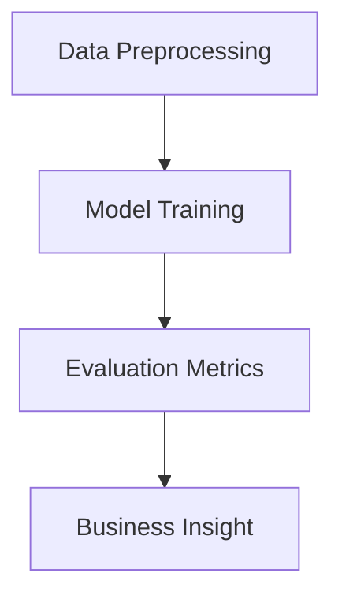
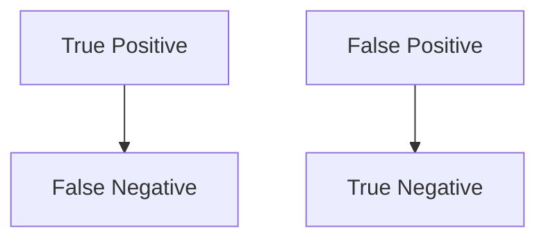

# Week 03 — Supervised Machine Learning in Finance

## Learning Objectives
- Understand supervised learning and its applications in finance
- Distinguish between classification and regression
- Implement Logistic Regression, Decision Trees, and Random Forests
- Evaluate models using accuracy, precision, recall, F1, ROC-AUC
- Apply ML to credit scoring and fraud detection
- Interpret model results using feature importance and SHAP

---

## What is Supervised Learning?
Supervised learning uses labeled historical data to train models that predict outcomes for new data. In finance, this enables risk assessment, credit scoring, and fraud detection.

---

## Classification vs Regression
| Task            | Output Type   | Example Use-case         |
|-----------------|--------------|-------------------------|
| Classification  | Discrete     | Credit Default (Yes/No) |
| Regression      | Continuous   | Loan Amount Prediction  |

---

## Logistic Regression in Credit Scoring
Logistic regression models the probability of default ($y=1$) given applicant features:

$$
P(y=1|x) = \frac{1}{1 + e^{-(\beta_0 + \beta_1 x_1 + \beta_2 x_2 + ... )}}
$$

- Coefficients ($\beta$) show feature impact on risk
- Decision boundary: $P(y=1|x) = 0.5$

---

## Decision Trees & Random Forests
- **Decision Trees**: Split data by feature thresholds, easy to interpret
- **Random Forests**: Ensemble of trees, reduces overfitting, improves stability

---

## Model Evaluation Metrics
- **Accuracy**: Overall correct predictions
- **Precision**: True positives / predicted positives
- **Recall**: True positives / actual positives
- **F1 Score**: Harmonic mean of precision & recall
- **ROC-AUC**: Area under ROC curve, measures discrimination

---

## Confusion Matrix Explained

|         | Predicted Yes | Predicted No |
|---------|---------------|--------------|
| Actual Yes | TP          | FN           |
| Actual No  | FP          | TN           |

---

## Feature Importance & Explainability
- **Permutation Importance**: Measures drop in accuracy when feature is shuffled
- **SHAP Values**: Quantifies each feature's impact on prediction

---

## Business Interpretation
- ML models help automate risk decisions
- High recall: fewer missed defaults, but may increase false positives
- Feature importance guides policy and compliance

---

## Key Takeaways
- Supervised ML enables robust risk assessment in finance
- Model choice and evaluation metrics depend on business goals
- Explainability is critical for regulatory compliance

---

## Further Reading
1. López de Prado, M. "Advances in Financial Machine Learning"
2. scikit-learn documentation: https://scikit-learn.org/stable/
3. Credit Scoring for Risk Management (Kaggle)
