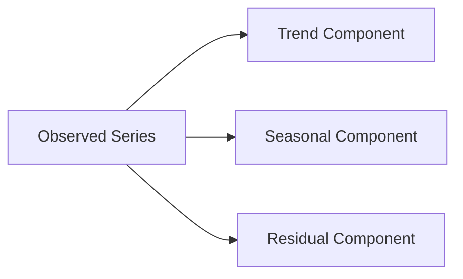
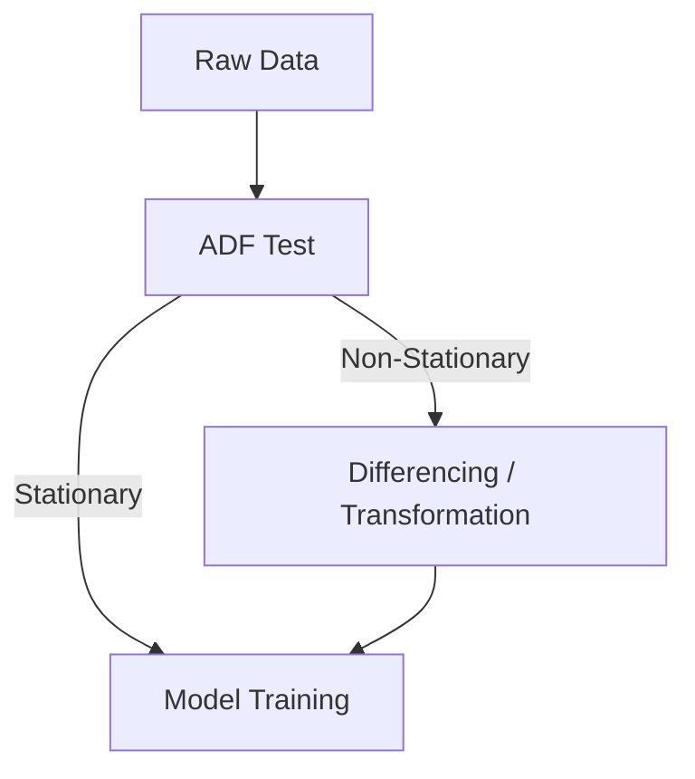
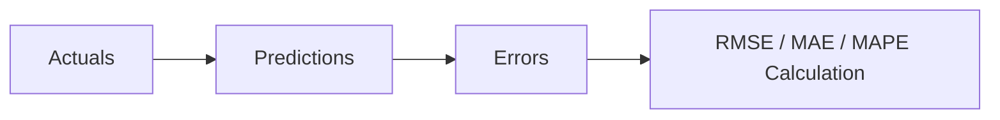
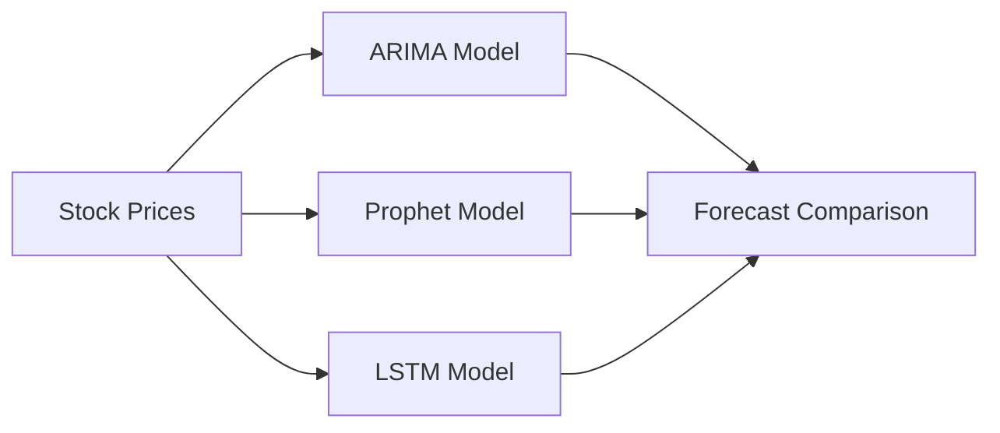

# Week 04 — Time Series Forecasting Models in Finance

## Learning Objectives
By the end of this week, students will:
- Understand financial time series properties: stationarity, autocorrelation, trends
- Implement classical forecasting models: ARIMA
- Apply modern forecasting methods: Prophet and LSTM
- Evaluate forecast accuracy using MAE, RMSE, MAPE
- Perform backtesting and rolling forecast validation
- Compare statistical vs deep learning forecasting approaches

---

## What is a Time Series?

A **time series** is a sequence of data points ordered chronologically. In finance, examples include:
- Stock prices over time
- Currency exchange rates
- Trading volumes
- Economic indicators

**Key Properties:**
- **Temporal dependency**: Current values depend on past values
- **Autocorrelation**: Values are correlated with their own past values
- **Non-stationarity**: Statistical properties change over time



---

## Stationarity and the ADF Test

**Stationarity** means statistical properties (mean, variance) remain constant over time.

**Augmented Dickey-Fuller (ADF) Test:**
- H₀: Series has unit root (non-stationary)
- H₁: Series is stationary
- If p-value < 0.05, reject H₀ (series is stationary)

```python
from statsmodels.tsa.stattools import adfuller
result = adfuller(price_series)
p_value = result[1]
```



---

## ARIMA Model

**ARIMA(p,d,q)** combines:
- **AR(p)**: Autoregressive - uses p past values
- **I(d)**: Integrated - d differences to achieve stationarity  
- **MA(q)**: Moving Average - uses q past forecast errors

**Structure:** $X_t = c + \phi_1 X_{t-1} + ... + \phi_p X_{t-p} + \theta_1 \epsilon_{t-1} + ... + \theta_q \epsilon_{t-q} + \epsilon_t$

**Use Cases:**
- Linear trends and patterns
- Short to medium-term forecasts
- When interpretability is important

---

## Prophet Model

**Prophet** decomposes time series as:
$y(t) = g(t) + s(t) + h(t) + \epsilon_t$

Where:
- **g(t)**: Trend component
- **s(t)**: Seasonal component
- **h(t)**: Holiday effects
- **ε(t)**: Error term

**Advantages:**
- Handles missing data automatically
- Robust to outliers
- Intuitive parameter tuning
- Built-in cross-validation

---

## LSTM Forecasting

**Long Short-Term Memory (LSTM)** networks capture:
- Long-term dependencies
- Non-linear patterns
- Complex temporal relationships

**Architecture:**
- Lookback window (e.g., 20 days)
- LSTM layers with memory cells
- Dense output layer for prediction

**Strengths:**
- Handles non-linear patterns
- Can incorporate multiple features
- Scalable to large datasets

---

## Forecast Evaluation Metrics



**Mean Absolute Error (MAE):**
$MAE = \frac{1}{n} \sum_{i=1}^{n} |y_i - \hat{y}_i|$

**Root Mean Squared Error (RMSE):**
$RMSE = \sqrt{\frac{1}{n} \sum_{i=1}^{n} (y_i - \hat{y}_i)^2}$

**Mean Absolute Percentage Error (MAPE):**
$MAPE = \frac{100\%}{n} \sum_{i=1}^{n} \left|\frac{y_i - \hat{y}_i}{y_i}\right|$

---

## Backtesting and Walk-forward Validation

**Backtesting** evaluates model performance on historical data using:
- **Fixed window**: Use same training period
- **Expanding window**: Grow training set over time
- **Rolling window**: Keep training window size constant

**Walk-forward validation** simulates real trading conditions by:
1. Train on historical data
2. Forecast next period
3. Move forward one period
4. Retrain and repeat

---

## Comparing Model Strengths



| Model | Strengths | Weaknesses | Best For |
|-------|-----------|------------|----------|
| **ARIMA** | Simple, interpretable, fast | Linear assumptions, manual tuning | Short-term, linear trends |
| **Prophet** | Handles seasonality, robust | Limited complexity | Business forecasting, seasonal data |
| **LSTM** | Non-linear, complex patterns | Black box, needs large data | Long-term, complex patterns |

---

## Key Takeaways

1. **Stationarity** is crucial for classical models like ARIMA
2. **Prophet** excels with seasonal patterns and missing data
3. **LSTM** captures complex non-linear relationships but requires more data
4. **Model selection** depends on data characteristics and forecast horizon
5. **Backtesting** is essential for realistic performance evaluation
6. **Ensemble methods** often outperform individual models

---

## Further Reading

1. **Hyndman, R.J.** - "Forecasting: Principles and Practice" (comprehensive guide)
2. **López de Prado, M.** - "Advances in Financial Machine Learning" (Chapter 5: Fractional Differentiation)
3. **TensorFlow Time Series Guide** - https://www.tensorflow.org/tutorials/structured_data/time_series
4. **Facebook Prophet Documentation** - https://facebook.github.io/prophet/
5. **Statsmodels ARIMA** - https://www.statsmodels.org/stable/generated/statsmodels.tsa.arima.model.ARIMA.html

---

*Week 4 Lecture Notes | Financial ML Bootcamp | Praveen Kumar*