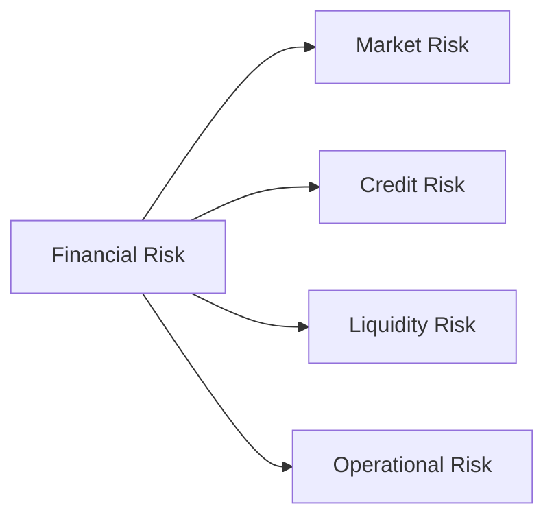
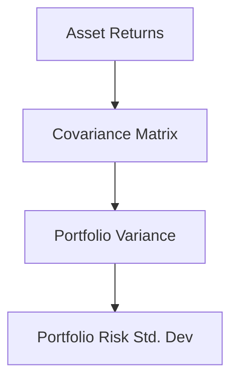

# Week 05 — Risk Modelling & Portfolio Optimization

## Learning Objectives
By the end of this week, students will:
- Understand different types of financial risk and their measurement
- Calculate Value at Risk (VaR) and Conditional Value at Risk (CVaR)
- Implement Monte Carlo simulation for portfolio risk estimation
- Apply Modern Portfolio Theory for risk-return optimization
- Compute Sharpe ratios and visualize efficient frontiers
- Build optimized portfolios using Python

---

## What is Financial Risk?

**Financial Risk** refers to the possibility of losing money on an investment or business venture. Understanding and quantifying risk is fundamental to making informed financial decisions.



**Types of Financial Risk:**
- **Market Risk**: Loss due to market movements (price, interest rate, currency)
- **Credit Risk**: Loss due to counterparty default
- **Liquidity Risk**: Inability to buy/sell assets quickly
- **Operational Risk**: Loss due to internal failures or external events

---

## Risk Measurement: VaR and CVaR

### Value at Risk (VaR)
**VaR** answers: "What is the maximum loss we expect with X% confidence over Y period?"

- **95% VaR**: Maximum loss expected 95% of the time
- **Example**: Daily 95% VaR of $1M means losses exceed $1M only 5% of days

### Conditional Value at Risk (CVaR)
**CVaR** (Expected Shortfall) measures the expected loss beyond the VaR threshold.

- **CVaR > VaR**: CVaR provides information about tail risk
- **Coherent Risk Measure**: CVaR satisfies mathematical risk measure properties

---

## Portfolio Theory Fundamentals

### Portfolio Return
The expected return of a portfolio is the weighted average of individual asset returns:

$$R_p = \sum_{i=1}^{n} w_i R_i$$

Where:
- $R_p$ = Portfolio return
- $w_i$ = Weight of asset i
- $R_i$ = Return of asset i

### Portfolio Risk
Portfolio variance considers both individual asset volatilities and correlations:

$$\sigma_p^2 = w^T \Sigma w$$

Where:
- $\sigma_p^2$ = Portfolio variance
- $w$ = Vector of weights
- $\Sigma$ = Covariance matrix



---

## Sharpe Ratio: Risk-Adjusted Performance

The **Sharpe Ratio** measures excess return per unit of risk:

$$S = \frac{R_p - R_f}{\sigma_p}$$

Where:
- $S$ = Sharpe ratio
- $R_p$ = Portfolio return
- $R_f$ = Risk-free rate
- $\sigma_p$ = Portfolio standard deviation

**Interpretation:**
- Higher Sharpe ratio = Better risk-adjusted performance
- Typical values: 0.5-2.0 for good strategies
- Negative values indicate underperformance vs risk-free rate

---

## Monte Carlo Simulation

Monte Carlo simulation generates thousands of random portfolios to explore the risk-return space:


**Process:**
1. Generate random portfolio weights (sum = 1)
2. Calculate portfolio return and risk
3. Compute Sharpe ratio
4. Repeat thousands of times
5. Plot results to visualize efficient frontier

---

## Efficient Frontier

The **Efficient Frontier** shows the optimal risk-return combinations:


**Key Properties:**
- **Upward sloping**: Higher return requires higher risk
- **Concave shape**: Diminishing returns to risk
- **Optimal portfolios**: Maximum return for given risk level
- **Diversification benefit**: Frontier lies above individual assets

---

## Modern Portfolio Theory (MPT)

**Markowitz (1952)** developed MPT with key insights:

1. **Risk-Return Trade-off**: Investors require higher returns for higher risk
2. **Diversification**: Combining assets reduces portfolio risk
3. **Correlation Effect**: Low/negative correlations improve diversification
4. **Optimal Allocation**: Mathematical optimization finds best weights

**MPT Assumptions:**
- Investors are risk-averse
- Returns follow normal distribution
- Correlations remain stable
- No transaction costs

---

## VaR and CVaR Calculation Methods

### Historical Simulation
Use historical returns to estimate future risk:
```python
# 95% VaR using historical data
var_95 = np.percentile(returns, 5)
cvar_95 = returns[returns <= var_95].mean()
```

### Parametric Method
Assume normal distribution:
```python
# Assuming normal distribution
from scipy.stats import norm
var_95 = norm.ppf(0.05, mean, std)
```

### Monte Carlo Method
Simulate future scenarios:
```python
# Generate random scenarios
simulated_returns = np.random.normal(mean, std, 10000)
var_95 = np.percentile(simulated_returns, 5)
```

---

## Risk vs Return Trade-off

**Key Principles:**
- **No Free Lunch**: Higher returns require accepting higher risk
- **Diversification**: Reduces risk without sacrificing expected return
- **Risk Premium**: Additional return demanded for bearing risk
- **Time Horizon**: Longer horizons may allow more risk tolerance

**Practical Implications:**
- Conservative investors: Focus on lower-risk assets
- Aggressive investors: Accept higher volatility for growth potential
- Balanced approach: Diversified portfolio along efficient frontier

---

## Portfolio Diversification Benefits

**Diversification Effects:**
- **Correlation < 1**: Portfolio risk < weighted average of individual risks
- **Negative correlation**: Maximum diversification benefit
- **Systematic vs Unsystematic Risk**: 
  - Unsystematic risk can be diversified away
  - Systematic risk remains (market risk)

**Optimal Number of Assets:**
- **Academic studies**: 20-30 stocks for good diversification
- **Practical considerations**: Transaction costs, management complexity
- **Asset classes**: Stocks, bonds, commodities, real estate

---

## Key Takeaways

1. **Risk Measurement**: VaR and CVaR provide quantitative risk metrics
2. **Portfolio Optimization**: MPT provides framework for optimal allocation
3. **Diversification**: Correlation structure drives risk reduction benefits
4. **Sharpe Ratio**: Standard measure for risk-adjusted performance
5. **Monte Carlo**: Powerful tool for exploring portfolio possibilities
6. **Efficient Frontier**: Visualizes optimal risk-return combinations
7. **Practical Implementation**: Python provides excellent tools for portfolio analysis

---

## Further Reading

1. **Markowitz, H. (1952)** - "Portfolio Selection" - *Journal of Finance*
2. **Hull, J.** - "Risk Management and Financial Institutions" (comprehensive risk text)
3. **Bodie, Kane & Marcus** - "Investments" (Chapter on Portfolio Theory)
4. **QuantStart Tutorials** - https://www.quantstart.com/articles/portfolio-optimization/
5. **Python for Finance** - Yves Hilpisch (practical implementation guide)
6. **Modern Portfolio Theory** - Edwin Elton et al. (advanced mathematical treatment)

---

*Week 5 Lecture Notes | Financial ML Bootcamp | Praveen Kumar*