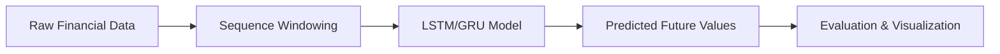
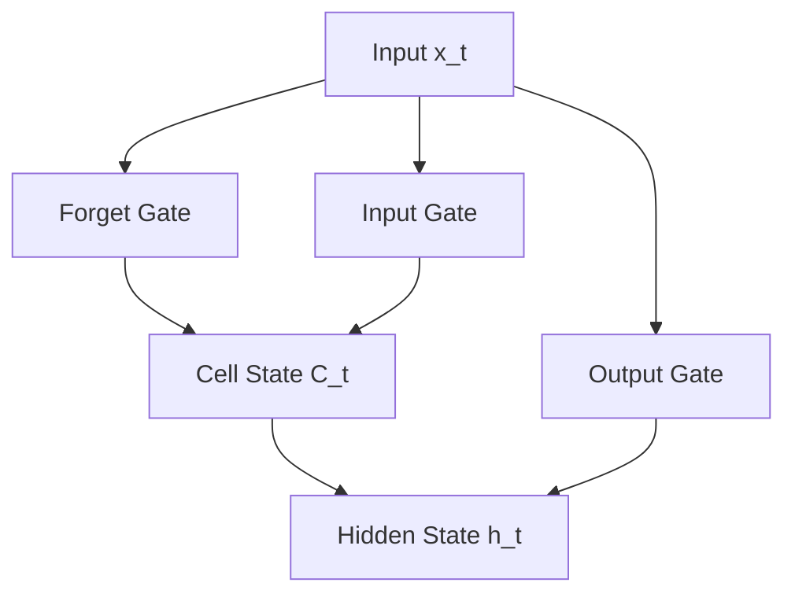
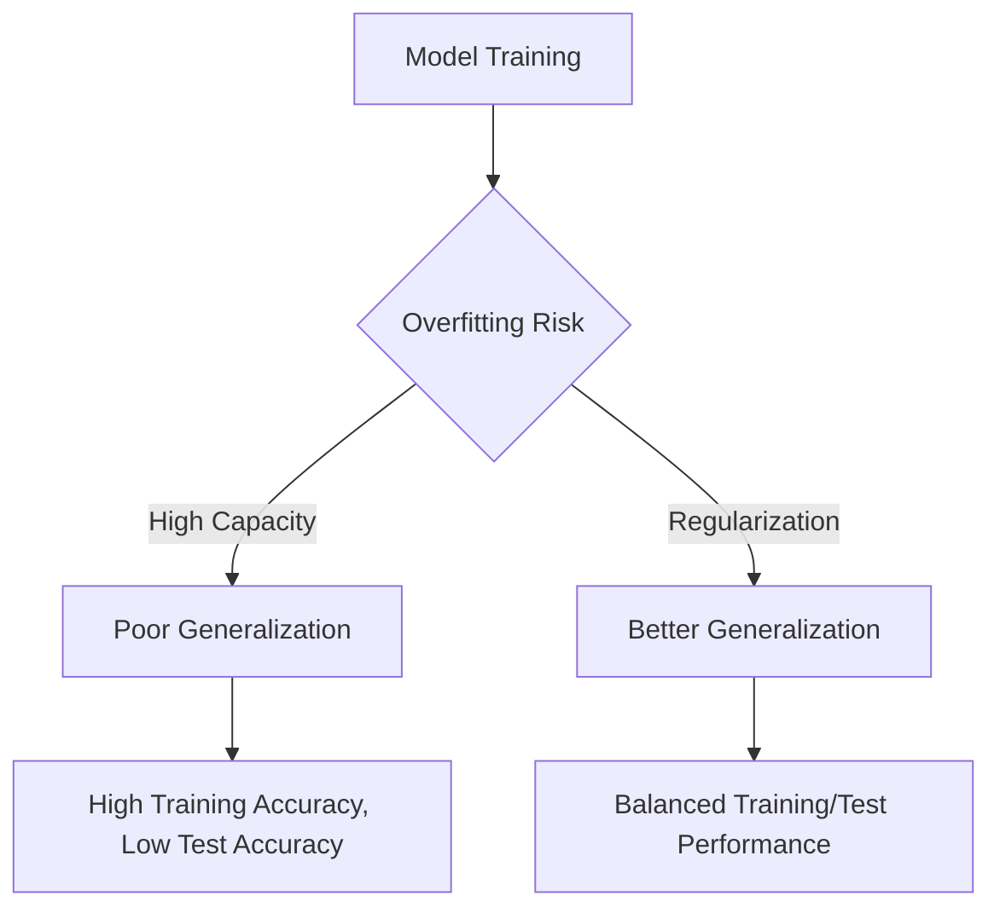
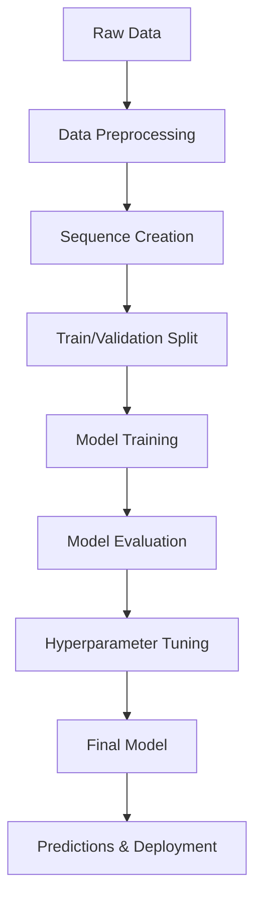

# Week 06 — Deep Learning Models for Financial Forecasting

## Learning Objectives
By the end of this week, students will:
- Understand the advantages of deep learning for financial time series forecasting
- Implement neural networks for regression tasks on financial data
- Build and compare RNN, LSTM, and GRU architectures for sequence prediction
- Apply proper data preprocessing techniques for sequence modeling
- Evaluate time series models using appropriate metrics (RMSE, MAPE)
- Compare deep learning approaches with traditional statistical methods
- Understand overfitting and regularization in temporal neural networks

---

## Why Deep Learning in Financial Forecasting?

Traditional statistical models like ARIMA assume linear relationships and stationarity. Financial markets, however, exhibit:

**Complex Non-linear Patterns:**
- Volatility clustering and regime changes
- Non-stationary trends and seasonal effects
- Multi-scale temporal dependencies (intraday, daily, weekly patterns)

**Deep Learning Advantages:**
- **Universal Approximation**: Can model any continuous function
- **Feature Learning**: Automatically discovers relevant patterns
- **Multi-scale Processing**: Captures both short and long-term dependencies
- **Non-linear Relationships**: Models complex market interactions



---

## Neural Networks 101

### Basic Architecture
A neural network consists of interconnected nodes (neurons) organized in layers:

- **Input Layer**: Receives features (e.g., historical prices, volume)
- **Hidden Layers**: Transform inputs through weighted connections
- **Output Layer**: Produces predictions (e.g., next day's price)

### Key Components:
1. **Weights (W)**: Connection strengths between neurons
2. **Biases (b)**: Threshold adjustments for activation
3. **Activation Functions**: Non-linear transformations (ReLU, tanh, sigmoid)
4. **Loss Function**: Measures prediction error (MSE for regression)
5. **Optimizer**: Updates weights to minimize loss (Adam, SGD)

### Forward Propagation:
```
y = f(W·x + b)
```
Where:
- x = input vector
- W = weight matrix
- b = bias vector
- f = activation function

---

## Recurrent Neural Networks (RNNs)

### The Sequential Challenge
Traditional neural networks treat each input independently. For time series, we need to capture:
- **Temporal Dependencies**: Today's price depends on yesterday's price
- **Sequential Patterns**: Market trends and momentum effects
- **Variable-Length Sequences**: Different forecasting horizons

### RNN Architecture
RNNs maintain a **hidden state** that carries information across time steps:

```
h_t = tanh(W_hh * h_{t-1} + W_xh * x_t + b_h)
y_t = W_hy * h_t + b_y
```

Where:
- h_t = hidden state at time t
- x_t = input at time t
- W_hh, W_xh, W_hy = weight matrices
- b_h, b_y = bias vectors

### RNN Limitations:
- **Vanishing Gradient Problem**: Difficulty learning long-term dependencies
- **Exploding Gradients**: Unstable training with large weight updates
- **Short Memory**: Information degrades over long sequences

---

## Long Short-Term Memory (LSTM)

### The Memory Solution
LSTMs solve the vanishing gradient problem through a sophisticated **memory cell** architecture with three gates:



### LSTM Gates:

1. **Forget Gate**: Decides what information to discard from cell state
   ```
   f_t = σ(W_f · [h_{t-1}, x_t] + b_f)
   ```

2. **Input Gate**: Determines what new information to store
   ```
   i_t = σ(W_i · [h_{t-1}, x_t] + b_i)
   C̃_t = tanh(W_C · [h_{t-1}, x_t] + b_C)
   ```

3. **Output Gate**: Controls what parts of cell state to output
   ```
   o_t = σ(W_o · [h_{t-1}, x_t] + b_o)
   ```

### Cell State Update:
```
C_t = f_t * C_{t-1} + i_t * C̃_t
h_t = o_t * tanh(C_t)
```

**Key Advantages:**
- **Long Memory**: Cell state carries information across many time steps
- **Selective Learning**: Gates control information flow
- **Gradient Stability**: Mitigates vanishing gradient problem

---

## Gated Recurrent Unit (GRU)

### Simplified LSTM Architecture
GRUs combine the forget and input gates into a single **update gate**, making them:
- **Computationally Efficient**: Fewer parameters than LSTM
- **Faster Training**: Simpler architecture reduces training time
- **Competitive Performance**: Often matches LSTM performance

### GRU Equations:
```
Update Gate: z_t = σ(W_z · [h_{t-1}, x_t])
Reset Gate:  r_t = σ(W_r · [h_{t-1}, x_t])
New Memory:  h̃_t = tanh(W · [r_t * h_{t-1}, x_t])
Final Output: h_t = (1 - z_t) * h_{t-1} + z_t * h̃_t
```

---

## Model Comparison

| Model | Strengths | Limitations | Best Use Cases |
|-------|-----------|-------------|----------------|
| **RNN** | Simple, interpretable | Vanishing gradients, short memory | Short sequences, baseline |
| **LSTM** | Long memory, stable training | Complex, slower training | Long sequences, complex patterns |
| **GRU** | Efficient, good performance | Less expressive than LSTM | Medium sequences, fast training |

---

## Sequence Preparation for Forecasting

### Windowing Technique
Transform time series into supervised learning format:

```python
# Example: Create sequences for forecasting
def create_sequences(data, lookback_window=30):
    X, y = [], []
    for i in range(lookback_window, len(data)):
        X.append(data[i-lookback_window:i])  # Past 30 days
        y.append(data[i])                    # Next day
    return np.array(X), np.array(y)
```

### Key Considerations:
- **Lookback Window**: How many past observations to use (typically 10-60 days)
- **Forecasting Horizon**: How far ahead to predict (1-day, 1-week, 1-month)
- **Feature Engineering**: Include volume, technical indicators, market sentiment
- **Data Scaling**: Normalize inputs to [0,1] or standardize to mean=0, std=1

---

## Model Evaluation Metrics

### Root Mean Square Error (RMSE)
Measures average prediction error magnitude:

$$RMSE = \sqrt{\frac{1}{n}\sum_{i=1}^{n}(y_i - \hat{y_i})^2}$$

**Properties:**
- Same units as target variable
- Penalizes large errors more heavily
- Lower values indicate better performance

### Mean Absolute Percentage Error (MAPE)
Measures relative prediction error:

$$MAPE = \frac{100\%}{n}\sum_{i=1}^{n}\left|\frac{y_i - \hat{y_i}}{y_i}\right|$$

**Properties:**
- Scale-independent (percentage)
- Easily interpretable
- Sensitive to near-zero values

### Additional Metrics:
- **MAE**: Mean Absolute Error (robust to outliers)
- **R²**: Coefficient of determination (explained variance)
- **Directional Accuracy**: Percentage of correct trend predictions

---

## Overfitting & Regularization

### The Overfitting Problem
Deep learning models can memorize training data without learning generalizable patterns:



### Regularization Techniques:

1. **Dropout**: Randomly deactivate neurons during training
   ```python
   model.add(Dropout(0.2))  # Drop 20% of connections
   ```

2. **Early Stopping**: Stop training when validation loss stops improving
   ```python
   EarlyStopping(monitor='val_loss', patience=10, restore_best_weights=True)
   ```

3. **L1/L2 Regularization**: Add penalty terms to loss function
4. **Batch Normalization**: Normalize layer inputs
5. **Cross-Validation**: Use multiple train/validation splits

### Best Practices:
- **Monitor Validation Loss**: Stop when it starts increasing
- **Use Dropout**: 0.1-0.3 dropout rate for LSTM/GRU layers
- **Start Simple**: Begin with fewer layers and parameters
- **Ensemble Methods**: Combine multiple models for robustness

---

## Comparing Deep Learning vs Statistical Models

### Statistical Models (ARIMA, Prophet):
**Advantages:**
- Interpretable parameters and assumptions
- Theoretical foundation and statistical tests
- Fast training and inference
- Work well with limited data

**Limitations:**
- Assume linear relationships
- Require manual feature engineering
- Limited ability to capture complex patterns
- May need stationarity preprocessing

### Deep Learning Models (LSTM, GRU):
**Advantages:**
- Capture non-linear patterns automatically
- Learn features from raw data
- Handle multivariate inputs naturally
- Scale with data availability

**Limitations:**
- Require large datasets
- Computationally expensive
- "Black box" - difficult to interpret
- Prone to overfitting

### When to Use Each Approach:

| Scenario | Recommended Approach |
|----------|----------------------|
| **Limited Data** (< 1000 points) | Statistical models (ARIMA, Prophet) |
| **Large Dataset** (> 10,000 points) | Deep learning (LSTM, GRU) |
| **Interpretability Required** | Statistical models |
| **Non-linear Patterns** | Deep learning |
| **Real-time Trading** | Statistical (faster inference) |
| **Research/Experimentation** | Deep learning |

---

## Implementation Architecture

### Typical Deep Learning Pipeline:



### Code Structure:
```python
# 1. Data Preparation
scaler = MinMaxScaler()
scaled_data = scaler.fit_transform(data)
X, y = create_sequences(scaled_data, lookback=30)

# 2. Model Architecture
model = Sequential([
    LSTM(50, return_sequences=True, input_shape=(30, 1)),
    Dropout(0.2),
    LSTM(50, return_sequences=False),
    Dropout(0.2),
    Dense(1)
])

# 3. Training
model.compile(optimizer='adam', loss='mse')
model.fit(X_train, y_train, validation_data=(X_val, y_val),
          epochs=100, batch_size=32, callbacks=[early_stopping])

# 4. Evaluation
predictions = model.predict(X_test)
rmse = np.sqrt(mean_squared_error(y_test, predictions))
```

---

## Key Takeaways

1. **Deep Learning Advantage**: Superior for capturing non-linear patterns in financial data
2. **LSTM/GRU Models**: Effectively capture time dependencies in sequential data  
3. **Proper Preprocessing**: Scaling and sequence windowing are essential for good performance
4. **Regularization**: Critical for preventing overfitting in complex models
5. **Evaluation**: Use multiple metrics (RMSE, MAPE) and out-of-sample testing
6. **Model Selection**: Choose based on data size, interpretability needs, and computational constraints
7. **Hybrid Approaches**: Combining statistical and deep learning methods often yields best results

---

## Further Reading

### Essential Papers:
1. **Hochreiter & Schmidhuber (1997)** - "Long Short-Term Memory" - Original LSTM paper
2. **Cho et al. (2014)** - "Learning Phrase Representations using RNN Encoder-Decoder for Statistical Machine Translation" - GRU introduction
3. **Fischer & Krauss (2018)** - "Deep learning with long short-term memory networks for financial market predictions"

### Books:
1. **"Deep Learning for Time Series Forecasting"** - Jason Brownlee
2. **"Hands-On Machine Learning"** - Aurélien Géron (Chapters 14-15)
3. **"Advances in Financial Machine Learning"** - Marcos López de Prado (Chapter 18)

### Online Resources:
1. **TensorFlow Time Series Tutorial**: https://www.tensorflow.org/tutorials/structured_data/time_series
2. **Keras Examples**: https://keras.io/examples/timeseries/
3. **Financial ML Course**: https://quantdare.com/deep-learning-for-finance/

### Practical Tools:
1. **TensorFlow/Keras**: Primary deep learning framework
2. **PyTorch**: Alternative deep learning framework
3. **yfinance**: Financial data acquisition
4. **scikit-learn**: Preprocessing and metrics
5. **Weights & Biases**: Experiment tracking

---

*Week 6 Lecture Notes | Financial ML Bootcamp | Praveen Kumar*